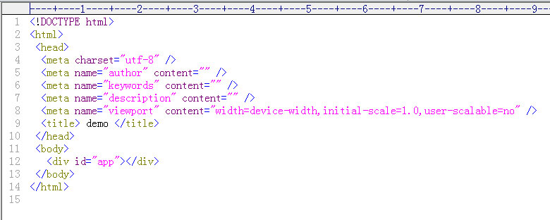

# 全程记录webpack插件编写过程

接着上一篇《全程记录webpack公用文件预打包过程》
## 修改public/index.html文件
   

   把红框内代码删除,结果：

   

## 创建InsertHtmlWebpackPlugin.js插件文件
   如图：

   

   由于HtmlWebpackPlugin是在"html-webpack-plugin-before-html-processing"勾子中返回了assets对象，以方便修整，
   
   HtmlWebpackPlugin相关代码截图：

   

   并且，HtmlWebpackPlugin是注册在Compiler的emit勾子上，所以在Compilation对象生成后，emit发生前注册"html-webpack-plugin-before-html-processing"勾子即可，在此，本人选择了Compliation勾子，即Compliation已经完成，即将emit。（流程勾子太多，具体自查资料）

## 编写插件代码
  
  如图所示：

  

## webpack.config.js中安装插件
   
   

## 执行webpack命令
  
  

## 最终结果

  生成build/index.html

  

---
over!

      

  
